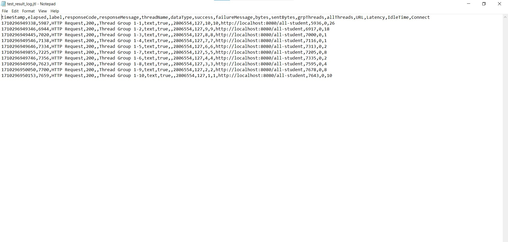

# Reflection
## Hasil JMeter Sebelum Optimize
### /all-student

Execution Time (Based on IntelliJ Profiller): 8.714 ms  

### /all-student-name

Execution Time (Based on IntelliJ Profiller): 1.123 ms

### /highest-gpa

Execution Time (Based on IntelliJ Profiller): 195 ms

## Hasil JMeter Setelah Optimize
### /all-student

Execution Time (Based on IntelliJ Profiller): 1.785 ms

### /all-student-name

Execution Time (Based on IntelliJ Profiller): 286 ms

### /highest-gpa

Execution Time (Based on IntelliJ Profiller): 78 ms

1. Dalam performance testing, JMeter hanya melakukan pengujian untuk sample time dan bagaimana web mereponse dari request yang diberikan ke endpoint melalui JMeter sehingga tidak dapat mengetahui seberapa lama website tersebut dapat memproses request. Sedangkan performance testing yang menggunakan IntelliJ Profiller mampu untuk menunjukkan execution time untuk tiap method yang terlibat pada website sehinga kita dapat mengetahui method mana yang memakan execution time paling lama.
2. Hasil dari proses profilling dari IntelliJ menunjukkan execution time untuk semua method yang terlibat pada suatu request ke endpoint dari website. Oleh karena itu, kita dapat menganalisa method mana yang memakan execution time paling lama dari request yang diberikan dan kita dapat mengoptimisasi method tersebut sehingga membutuhkan execution time lebih singkat.
3. Ya, karena IntelliJ Profiller dapat menunjukkan semua method yang terlibat dalam request yang diberikan beserta execution time dari masing-masing method sehingga kita mampu mengetahui method mana yang memakan execution time paling lama dan perlu untuk dilakukan optimisasi.
4. Salah satu tantangan bagi saya dalam performance testing dan profiling adalah pada saat melakukan profiling, method yang ditampilkan terlalu banyak sehingga perlu untuk teliti dalam mencari method yang mengalami bottleneck. Namun, kita dapat mempermudah proses pencarian method yang mengalami bottleneck dengan memanfaatkan CTRL+F lalu mencari package dari web app kita sehingga kita dapat menemukan method dari web app kita yang paling banyak memakan execution time untuk suatu request tertentu.
5. Keuntungan utama dari memanfaatkan IntelliJ Profiler untuk proses profiling adalah kita dapat mendapatkan data execution time dari semua method yang terlibat pada suatu request sehingga kita mampu untuk mengidentifikasi method mana yang perlu untuk dilakukan optimisasi.
6. Ketidak-konsistenan profiling dengan JMeter dapat dipengaruhi oleh banyak faktor, misalkan OS, hardware PC, JVM, dsb. Ada beberapa hal yang dapat dilakukan untuk menanggulangi masalah tersebut:
    - JMeter dibungkus dengan container seperti Docker dan pastikan untuk melimit penggunaan hardware pada container tersebut seperti processor, memori dll.
    - Menambahkan delay untuk tiap request yang terjadi di JMeter sehingga dapat membuat program untuk beristirahat sejenak dan tidak mengalami work overload
7. Strategi yang diimplementasikan untuk mengoptimisasi kode setelah menganalisa hasil dari performance testing dan profiling adalah dengan melihat method dari web app yang mengalami bottleneck. Kemudian, kita lihat method tersebut apakah ada aspek yang dapat dioptimisasi sehingga berjalan lebih cepat. Missalkan, pada method getAllStudentsWithCourse() kita menggunakan loop dalam loop. Padahal, kita dapat mempersingkatnya menjadi return studentCourseRepository.findAll(). Kemudian, untuk memastikan bahwa optimisasi kode yang dilakukan tidak mempengaruhi kebenaran dan fungsionalitas program, kita dapat membuat unit test untuk melakukan pengujian dari output yang dihasilkan. 
